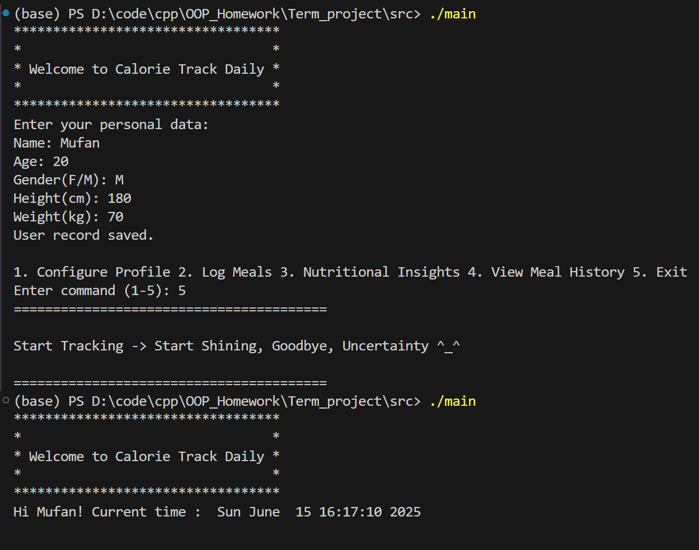

## <center>Docs</center>

### 1. Structure

我们将整个项目的架构大致分为3层：
- UI层(Menu)
- 业务逻辑层(DietReport/User/Food/DietRecord)
- 数据层(Database)
  
UI层主要负责与用户交互，接收用户的指令，并将任务传递给业务逻辑层；业务逻辑层负责完成特定的任务，实现具体的功能；数据层负责与数据库通信，读取并写入数据。

```text
Main
│
└── Menu (用户界面控制中心)
    │
    ├── User (用户管理)
    ├── Food (食物数据库) 
    ├── DietRecord (饮食记录)
    ├── DietReport (营养报告)
    └── Date (日期处理)
         └── Database (数据持久化)
```

### 2. Class Design


#### Database模板类

Database模板类是其他类和数据库文件通信的桥梁，是整个项目中处于最底层的部分。

在Database类中我们定义了3个私有成员变量：`string filename`代表我们将要访问的数据库文件的路径，由相对路径表示；`string column`代表我们将要访问的数据在csv文件中所在列的列名；`int row`代表我们将要访问的数据在csv文件中所在行的索引。

在这个项目中，我们的数据库由csv文件组织而成。我们有必要对数据库csv文件的读写操作的代码逻辑进行说明。

我们知道，csv文件一行中的各列以逗号分隔，要对csv文件进行访问就需要对它进行解析。`SplitCSVLine`函数的功能就在于此：它将读取的一行按逗号分隔成多个独立的元素，放入一个vector中返回，同时删除每个字符串开头和末尾的空白符。

对数据库文件的读取主要由`Read`函数来完成。在`Read`函数中，我们首先打开文件，获取标题行。然后调用`SplitCSVLine`将标题行解析为多个单个独立的标题，在这些标题中寻找与`column`变量相同的标题，并记住它的索引。随后忽略所要读取的行之前的行。在读到目标行时，依旧是先调用函数解析，随后取出对应索引处的元素。返回时需要调用`StringToValue`函数，将从csv文件读出的string类型转换为模板实例化对应的类型。

对数据库文件的写入，我们设计了两个函数--`WriteNewLine`和`AddNewLine`。之所以这么设计是因为我们对数据库写入是一般是以行为单位的。`WriteNewLine`函数会覆盖原来的行，适用于修改用户个人信息；`AddNewLine`函数会向csv文件的末尾增添一整行，适用于增添食物和饮食记录。

#### Date类

Date类用来表示日期，它有3个核心私有成员变量，分别表示年、月、日。

在Date类中我们提供了各种方法，包括验证日期的合法性、闰年校验等。同时我们还重载了==和!=运算符，便于Date类变量之间的比较。

#### DietRecord类

DietRecord类用来管理饮食记录，它有5个核心私有成员变量，即日期、食物类别、食物名称、摄入重量、摄入能量。其中摄入能量由摄入重量和对应食物的单位能量算出。

这里我们定义了一个特殊的函数--`Save()`。它是DietRecord类与Database类交互的接口，负责将当前的实例添加到饮食记录数据库中。

#### DietReport类

DietReport类负责生成健康分析报告，它有3个核心私有成员变量，分别表示用户、饮食记录数据和当天的日期。另外还有6个变量，用来记录当天摄入的总能量和5个食物门类各自摄入的重量。

#### Food类

Food类用来管理食物，它有3个核心私有成员变量，即食物类别、食物名称和单位能量。

我们提供了`SearchFoodCalorie`函数，可以根据食物的类别和名称，返回对应的单位能量，是沟通Food类和DietRecord类的桥梁。

这里的`Save`函数的功能和DietRecord类中相同。

#### User类

User类用来表示用户，它有5个核心私有成员变量，即姓名、年龄、性别、身高、体重。另外还有5个变量，用来表示bmi，身体状况，基础代谢率，活动系数和每日卡路里建议摄入量。

在这个类中有3个函数比较特殊：`Load`函数用来在程序启动时从数据库文件中加载用户信息；`Init`函数用来在程序首次运行时录入用户信息；`Configure`函数在用户信息被修改时会被使用。

#### Menu类

Menu类用来管理菜单，是整个项目的核心框架。它有4个核心私有成员变量，即用户、食物数据、饮食记录数据和日期。

`LoadFoods`和`LoadDietRecords`负责在程序启动时将食物数据库和饮食记录数据库中的数据装载到程序中；`Greeting`在程序启动时向用户打招呼；`ConfigureUser`用于配置用户信息；`MainMenu`是主菜单，其它5个函数则分别是主菜单下的选项。

`MainMenu`函数内主体是一个while循环，循环内是一个`switch...case...`语句。如果命令为Exit，则会退出循环，即退出主菜单；如果是其他，则会调用相应的函数；如果输入错误，则会提示用户输入错误，并清空缓冲区。

#### Main函数

由于我们Menu类封装得较为完善，所以主程序main函数异常简单，只调用了3个Menu类中的函数`Greeting()`，`ConfigureUser()`和`MainMenu()`，便完成了整个程序的内容，清晰直观。

#### Others

除了这些类之外，我们还定义了一个RIO(Robust Input/Output)库，里面放入了我们自己定义的更加健壮的输入输出函数。`Clear`函数用来在用户输入错误时清空输入缓冲区，避免反复输入；由于在程序中我们只用有限的个别字母代表性别和食物类别，所以有必要检查用户的输入，并在用户输入错误时纠正用户，`GetGender`和`GetCategory`便是我们自己包装的函数。

### 3. Working Process


### 4. Design Highlights

#### 4.1 完善的异常处理

在程序中，我们大量使用`throw error`和`try{...} catch{...}`语句进行错误处理，包括打开文件失败、用户输入错误等情况，并对每种错误提供了对应的清晰的提示。这样做既增加了程序的健壮性，又降低了调试的难度。

#### 4.2 对数据库的写回

我们采用这样一种方式来更新食物和饮食记录数据库：先根据用户输入的信息构造出对应的类的对象，随后将这个类对象添加到程序初始装载的vector中，同时调用DietRecord类和Food类中各自的`Save`函数，将自身添加到数据库文件中。这样便同时完成了程序中的缓存和数据库文件的更新。

### 5. Test Method

测试也是软件开发中非常重要的一步。我们在测试时分模块，分步骤地进行调试，力求对程序所有功能，以及在各种情况下的表现做一个全面的测试。

#### 5.1 只对数据库进行读取操作，不进行写入
   
也就是说我们的数据库中本身就有数据，这部分数据由我们手动输入。

这个步骤用来测试对数据库的读取功能和主菜单中的3和4能否完成。


#### 5.2 饮食记录数据库为空，食物数据库和用户数据库有数据

这个步骤用来测试对数据库的写入功能和主菜单的2中食物在数据库中的情况能否完成。


#### 5.3 饮食记录数据库和食物数据库是空的，用户数据库有数据

这个步骤用来测试主菜单的2中食物不在数据库中的情况能否完成，同时测试主菜单的1功能。


#### 5.4 数据库全部为空

这个步骤用来测试程序首次运行时用户录入数据，并且在再次运行时可以读取出上次录入的数据。



#### 5.5 经过上述几个步骤后，已经证明程序的主体功能可以完成。但是前面的步骤都是在用户的输入完全正确的前提之下。现在我们需要人为地制造一些错误情况，观察程序能否正确地处理这些异常。
   
- 输入命令错误


- 输入日期错误
   


### 6. Future Prospect

#### 6.1 提供更加丰富的错误处理

本项目中只使用了domain_erroe这一种错误形式，c++还有许多丰富的错误类型，比如runtime_error等等。

同时，我们只在用户输入性别和食物种类时对输入进行了检查，在输入其他时则没有，这可能存在隐患。比如在要求用户输入年龄时，如果用户输入了字母，则会引发程序崩溃。

#### 6.2 降低代码的重复性

生成健康分析报告时，我们使用了简单地复用代码的方式，将报告同时输出到文件和屏幕。或许可以使用更加简洁高效的方式实现这一点，减少代码的重复，同时增加维护的方便。

#### 6.3 改进数据库模板类的交互逻辑

在其他类与数据库模板类交互时，用户需要知道csv文件的结构，才可以正确地向数据库中写入数据，这一点是不自然的。

#### 6.4 改进程序启动时加载缓存的方式

在每次程序启动时，我们都将食物数据库和饮食记录数据库中的数据装载到程序中。如果数据量小还好说。但是如果数据量很大，那么这样做不仅会严重影响程序的启动速度，还会占用很大内存。更好的做法是将数据库用一种更好的方式组织起来，在程序运行过程中动态加载，每次只加载需要的部分。

#### 6.5 改进缓存的数据结构

在记录饮食时，我们查找对应食物时使用的方式是顺序查找。这样做的效率是低下的。我们可以采用更先进的数据结构，比如二叉树或哈希表，提高查找效率。

#### maybe...

使用csv文件作为数据库有诸多缺点，一是不方便操作，需要进行多余的解析，二是如果数据量过大，那么读写的时间复杂度也会呈线性时间上升，造成性能的损耗，三是csv文件的格式也不方便对数据进行管理。未来可以考虑将SQL作为数据库管理的方式。

同时使用命令行终端作为与用户的交互界面也显得有些简陋，如果可以设计一些前端页面，那么用户体验将更加完善。